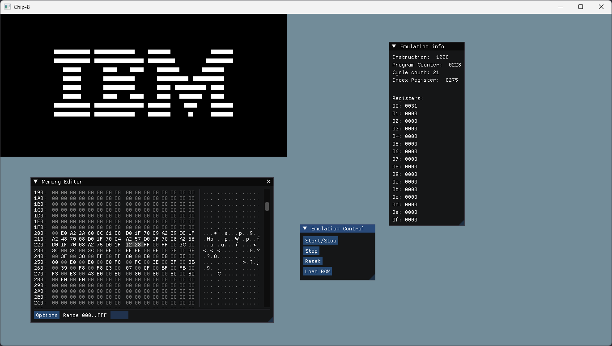

# chip8-cpp
This is my hobby CHIP-8 interpreter written in C++.

I had previously built a CHIP-8 interpreter in Python in order to get a grasp on how it should work; the purpose of this project is instead to practice/learn more about C++ and cross-platform development.



## Compiling

### Windows
```
meson setup build-win
meson compile -C build-win
```

### Nintendo Switch
- Requires [DevKitPro](https://switchbrew.org/wiki/Setting_up_Development_Environment) installed on Linux  
  - Change the `DEVKITPRO` variable in `meson.build` if your DevKitPro install is not located at `/opt/devkitpro`
- Building the `nro` target will create a `.nro` file that can be launched on a modded Switch via HBMenu
```
meson setup build-nx --cross-file devkitA64.cross
meson compile -C build-nx nro
```